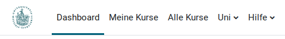
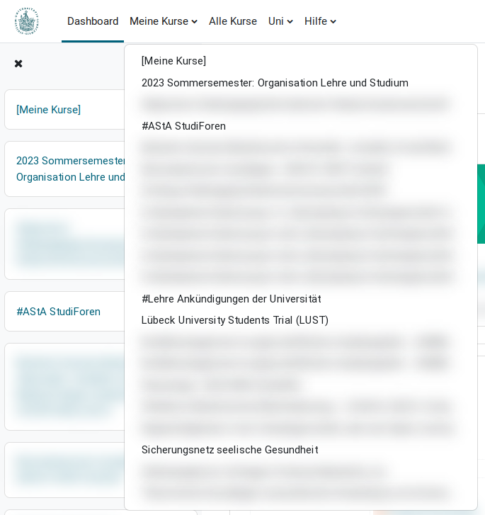
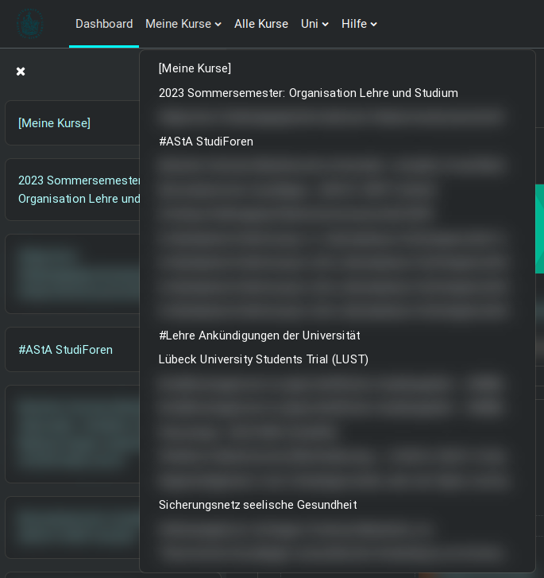
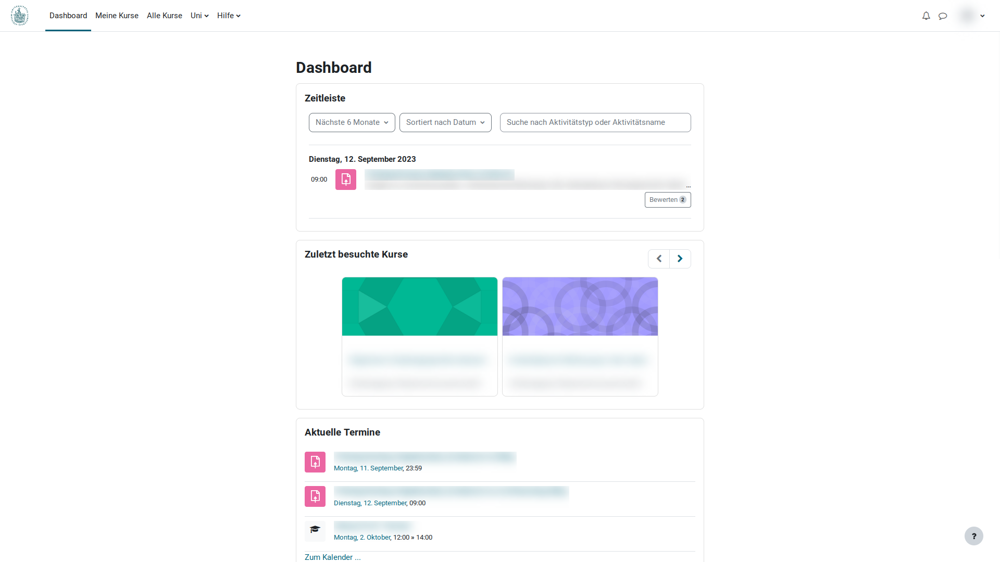
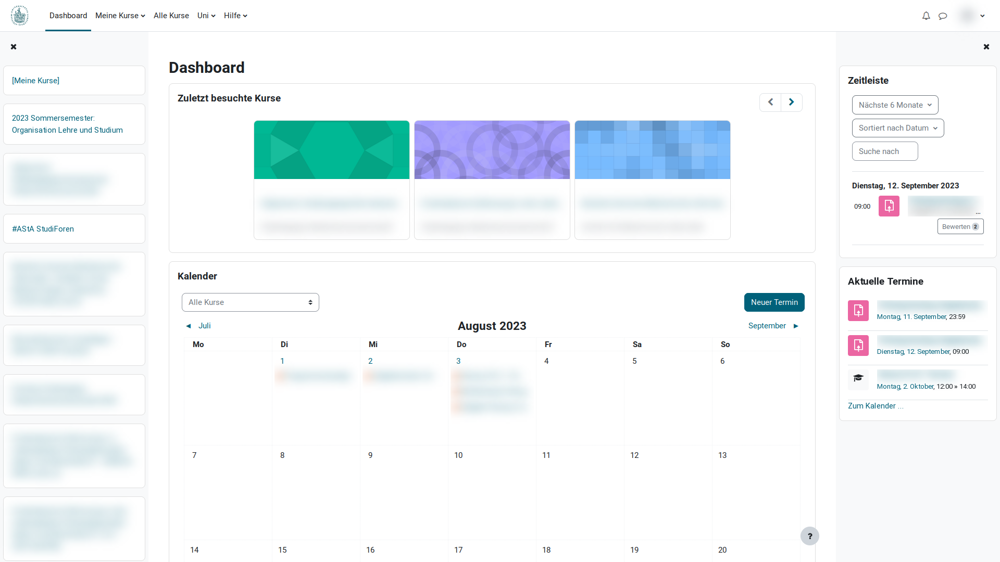
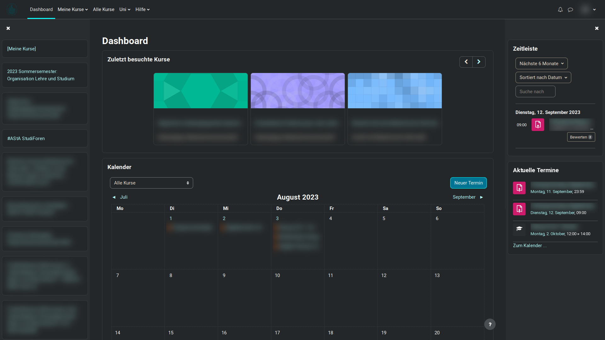
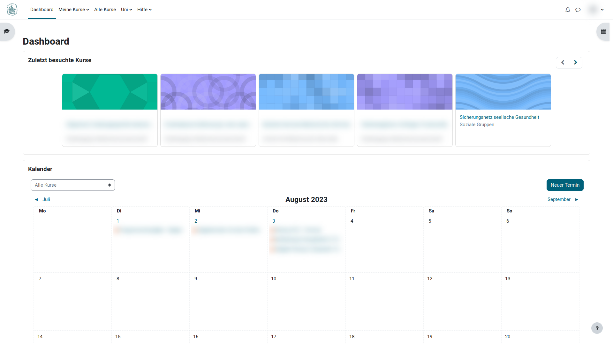
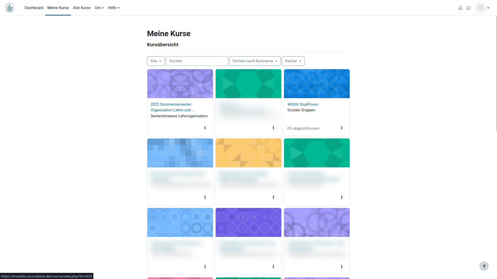
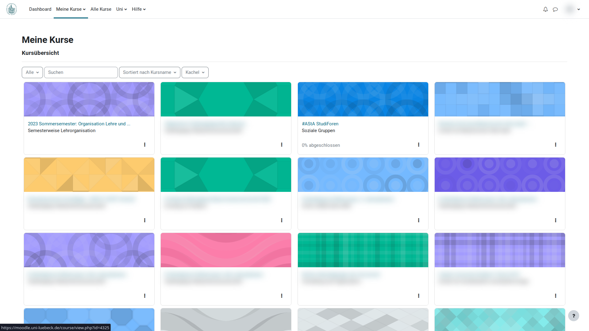
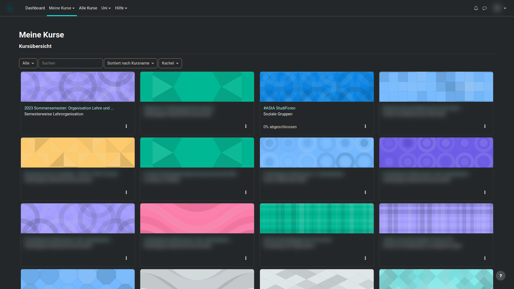

# Better-Moodle

[](https://github.com/jxn-30/better-moodle/releases/latest)

-   [Installation](#installation)
-   [Disclaimer](#disclaimer)
-   [Update](#update)
    -   [Changelog](#changelog)
-   [Hochschulen](#hochschulen)
-   [Features](#features)
-   [FAQ](#faq)
-   [Alte Bilder und Impressionen](#alte-bilder-und-impressionen)
-   [Better-Moodle ohne Userscript-Manager nutzen](#better-moodle-ohne-userscript-manager-nutzen)

[//]: # 'TODO: More english translations'

Better-Moodle ist ein Userscript, um das Design vom [UzL Moodle](https://moodle.uni-luebeck.de/) zu verbessern und zusätzliche, coole Features hinzuzufügen.

🇬🇧 Better-Moodle is an userscript to improve the design of [UzL Moodle](https://moodle.uni-luebeck.de/) and add additional, cool features.

_Bilder in dieser Beschreibung enthalten teilweise verschwommene Elemente, um den Datenschutz zu wahren._

> **🇬🇧 English Version**
>
> Better-Moodle will use English translations whenever the page indicates to be in english.
>
> Within this README, English texts can be found - if available - in the extendable areas marked with `🇬🇧`. They can be opened and closed by clicking on the respective area.

## Installation

1. Userscript-Manager als Browser-Erweiterung installieren (z. B. [Tampermonkey](https://tampermonkey.net))
2. Klicke [hier][installation], um Better-Moodle zu installieren
3. Moodle einmal neu laden und ein besseres Moodle genießen 🎉
4. Bei Bedarf über das Zahnräder-Icon oben rechts im Moodle, neben deinem Profilbild, Better-Moodle individualisieren

<details>
<summary>🇬🇧 Installation</summary>

1. install an Userscript-Manager as a browser extension (e.g. [Tampermonkey](https://tampermonkey.net))
2. click [here][installation] to install Better-Moodle
3. reload Moodle once and enjoy a better Moodle 🎉
4. if required, customize Better-Moodle via the gears icon at the top right of Moodle, next to your profile picture
 </details>

## Disclaimer

Better-Moodle wurde privat von einem Fachschaftsmitglied entwickelt und ist kein offizielles Projekt der Uni. Es dient ausschließlich dazu, die individuelle Moodle-Nutzung zu verbessern, und sammelt keinerlei Daten. Die Nutzung geschieht natürlich dennoch auf eigene Verantwortung! ;)

Bei der Verwendung von Userscript-Managern wie Tampermonkey wird ein externes Tool genutzt, für das wir nicht zuständig oder verantwortlich sind. Es wird zur Vorsicht bei der Installation weiterer Userscripts geraten.

<details>
<summary>🇬🇧 Disclaimer</summary>

Better-Moodle was developed privately by a member of FS MaIn and is not an official project of the university. Its sole purpose is to improve the individual use of Moodle and does not collect any data. Of course, you still use it at your own risk ;)

When using userscript managers such as Tampermonkey, an external tool is used for which we are not responsible. Caution is advised when installing additional userscripts.

</details>

## Update

Die meisten Userscript-Manager suchen regelmäßig nach Aktualisierungen. Eine manuelle Aktualisierung von Better-Moodle ist auch jederzeit über den [Installationslink][installation] möglich.

Wenn in den Einstellungen aktiviert, wird Better-Moodle auch einen kleinen roten Punkt neben dem Einstellungen-Icon in der Navigationsleiste anzeigen, wenn ein Update verfügbar ist. In den Einstellungen kann, wenn ein Update verfügbar ist, die Aktualisierung durchgeführt werden.

### Changelog

Better-Moodle erhält regelmäßig Updates. Ein vollständiges Changelog ist in der Datei [CHANGELOG.md](./CHANGELOG.md) zu finden. Das Changelog ist auch über das Einstellungen-Menü über den Button in der linken unteren Ecke der Fußleiste erreichbar.

## Hochschulen

Es gibt ganz viele, ganz tolle Menschen, die gerne programmieren und so breitet sich das Better-Moodle mit der Zeit auch auf anderen Hochschulen aus. Von diesen Hochschulen ist bekannt, dass Better-Moodle von ehrenamtlichen Studis entwickelt und getestet wird:

- **Original: [Universität zu Lübeck (UzL)](https://github.com/jxn-30/better-moodle)** by [@jxn-30](https://github.com/jxn-30)
- [CAU Kiel](https://github.com/YorikHansen/better-moodle) by [@YorikHansen](https://github.com/YorikHansen)

## Features

Alle Features von Better-Moodle lassen sich in den Einstellungen (de-)aktivieren. Die Einstellungen sind über das Icon mit den Zahnrädern in der rechten oberen Ecke neben dem Profilbild in der Navigationsleiste erreichbar.

[//]: # 'TODO: Add pictures settings-btn'

> _Dunkles Design_  
> Nein, Better-Moodle hat keinen Dark-Mode. Wir empfehlen die Verwendung der Browser-Erweiterung [Dark Reader](https://darkreader.org/).
> Beispielhaft sind auf dieser Seite Screenshots mit einem Helligkeitswert von 100 % und einem Kontrastwert von 150 % in Dark Reader zu sehen.

### Volle Breite

Aktuell begrenzt Moodle die Breite der Inhalte und lässt einen großen weißen Rand. Better-Moodle entfernt diesen Rand und lässt die Inhalte immer die volle Breite des Bildschirms nutzen.

[//]: # 'TODO: Add pictures full-width'

### Externe Links

Standardmäßig öffnet Moodle externe Links manchmal im selben Tab. Mit dieser Einstellung werden externe Links immer in einem neuen Tab geöffnet.

### Abgeschnittene Texte

Manche Texte, insbesondere in der Seitenleiste, sind in Moodle abgeschnitten. Seitens Moodle gibt es momentan leider keine Möglichkeit, den vollständigen Text zu sehen. Diese Einstellung ermöglicht es, den vollständigen Text zu lesen, wenn mit der Maus über den Text fährst und dort kurz verweilst.

### Lesezeichen-Manager

Manche Menschen nutzen den Lesezeichen-Manager ihres Browsers, um ihre Lesezeichen zu verwalten. Andere nutzen Better-Moodle, um ihre Lesezeichen zu verwalten. Better-Moodle bietet die Möglichkeit, Lesezeichen zu speichern und zu verwalten. Die Lesezeichen sind über das Lesezeichen-Icon in der rechten oberen Ecke der Navigationsleiste erreichbar.

[//]: # 'TODO: Add pictures bookmark-manager'

### Download unterbinden

Moodle scheint es zu lieben, Dateien runterzuladen, aber nicht jeder freut sich darüber, wenn der eigene `Downloads`-Ordner des Gerätes zugemüllt wird, weil dasselbe Übungsblatt jetzt schon zum 5. mal heruntergeladen wurde. Diese Einstellung versucht, das automatische Herunterladen von Dateien zu verhindern, das geht aber leider nicht immer, aufgrund der Einschränkungen von Userscripten. Die Erfahrung hat gezeigt, dass sich die Menge aber trotzdem schon deutlich reduziert.

### Event-Ankündigungen

Wusstest du schon, dass es an deiner Lieblings-Uni ganz tolle studentische Gremien gibt? Wir veranstalten unter anderem regelmäßig coole Events, einige wenige davon werden in der Navigationsleiste angekündigt. Dabei handelt es sich um größere Events, wie z. B. die beiden Adventsveranstaltungen oder das COAL.
Ja, du kannst diese Ankündigungen natürlich auch ausschalten, wenn du sie nicht sehen möchtest.

[//]: # 'TODO: Add pictures event announcements'

### Countdown bis Heiligabend

Kommt Weihnachten bei dir auch jedes Jahr so plötzlich und unerwartet? Dann ist dieser kleine Countdown genau das richtige für dich, denn er erinnert dich jederzeit im Moodle in der Navigationsleiste daran, wie viele Tage es noch bis Heiligabend sind.
Teilnehmenden des Mathe-Vorkurses und manch einer "Analysis 1" Vorlesung kommt dieser Countdown sicherlich bekannt vor, denn diese Einstellung ist eine kleine Hommage an dieses Erlebnis.

[//]: # 'TODO: Add pictures christmasCountdown'

### Layout im Dashboard

Das Dashboard ist eine tolle Sache, denn dort hat man den Überblick über anstehende Termine etc. Leider ist das Standard-Dashboard von Moodle nicht besonders flexibel und es fehlt eine Übersicht über alle eigenen Kurse.
Mit Better-Moodle wird genau so eine "Meine Kurse"-Seitenleiste links hinzugefügt, die alle eigenen Kurse auflistet. Außerdem werden die "Zeitleiste" und der Bereich "Aktuelle Termine" in eine rechte Seitenleiste verschoben, um mehr Platz für die Inhalte zu schaffen.

Es ist geplant, dass sich alle Nutzer von Better-Moodle dieses Layout selbst anpassen können, um individuell zu bestimmen, welche Features genutzt werden möchten und wo diese zu sehen sein sollen. Aktuell sit aber das Standard-Layout fest vorgegeben.

[//]: # 'TODO: Add pictures dashboard'

### Filter der Kurse-Sidebar

Standardmäßig zeigt die "Meine Kurse"-Seitenleiste im Dashboard genau die Kurse an, die auch gerade auf der "Meine Kurse"-Seite angezeigt werden. Du kannst aber über diese Einstellung auch einen festen Filter auswählen. Verfügbar sind genau die Filter, die auch in der "Meine Kurse"-Seite vorhanden sind.

Diese Filter-Einstellung kannst du auch über das Trichter-Icon in der Seitenleiste ändern, ohne erst aufwendig die Einstellungen öffnen zu müssen.

### Meine Kurse: Kacheln pro Leiste

Ist auf der "Meine Kurse"-Seite die Ansicht auf "Kacheln" gestellt, so werden von Moodle nur 3 Kacheln pro Zeile angezeigt.
Gerade in Kombination mit der Einstellung "Volle Breite", sehen die Kacheln so sehr gestreckt aus, weshalb diese Einstellung es ermöglicht, die Anzahl der Kacheln pro Zeile zu ändern. Möglich sind Werte von 1 bis 10 (jeweils inklusive).

### "Meine Kurse"-Dropdown in der Navigationsleiste

Analog zur "Meine Kurse"-Seitenleiste im Dashboard gibt es auch eine Dropdown für die Navigationsleiste. Damit kannst du deine Kurse nicht nur vom Dashboard aus direkt erreichen, sondern auch von jeder anderen Seite aus.

[//]: # 'TODO: Add pictures my-courses dropdown'

#### Filter der Kurs-Dropdown

Auch hier kannst du einen Filter für die Kurse auswählen, die in der Dropdown-Liste angezeigt werden sollen. Die verfügbaren Filter sind dieselben wie in der "Meine Kurse"-Seite. Diese Einstellung kannst du nur über die Einstellungen ändern.

### Link zu Bewertungen in der Sidebar

Du möchtest in deinen Kursen die Bewertungen öffnen können, ohne erst aufwendig auf die Hauptseite des Kurses zu wechseln? Mit dieser Einstellung wird ein Link oben in die linke Seitenleiste in Kursen hinzugefügt, über die du direkt zu den Bewertungen des jeweiligen Kurses gelangst.

[//]: # 'TODO: Add pictures bewertungen'

#### Bewertungen in neuem Tab öffnen

Manche Menschen möchten gerne, dass die Bewertungen standardmäßig in einem neuen Tab statt im aktuellen geöffnet werden. Das kannst du über diese Einstellung erreichen.

### Seitenleiste vollständig ein-/ausklappen

Manchmal möchte man alle Einträge der Seitenleiste in Kursen auf einmal einklappen oder auch ausklappen. Das geht mit dieser Einstellung, indem du einfach auf eines der Symbole zum Ein- bzw. Ausklappen doppelklickst. Es werden dann alle Einträge der Seitenleiste entsprechend zusammengeklappt oder wieder ausgeklappt.

### Bildüberlauf verhindern

Ist ein Bild sehr breit, so kann es passieren, dass es in den Seiten eines Kurses über den rechten Rand hinausgeht und man dann horizontal scrollen kann. Das ist nicht besonders schön, weshalb diese Einstellung dafür sorgt, dass Bilder nicht mehr über den rechten Rand hinausgehen können.

### Bilder zoomen

Kleine Bilder sind schwer zu erkennen, deshalb ermöglicht es dir diese Einstellung, Bilder in Kursinhalten per Klick heranzuzoomen, um sie besser erkennen zu können. Per Klick auf das heran gezoomte Bild kannst du es wieder auf Standardgröße zurücksetzen.

### Hinweis zur Selbsteinschreibung ohne Einschreibeschlüssel ausblenden

In manchen Kursen zeigt Moodle einen Hinweis an, dass die Selbsteinschreibung ohne Einschreibeschlüssel aktiviert ist (nur NutzerInnen mit entsprechenden Rechten können diesen Hinweis sehen). Dieser Hinweis kann mit dieser Einstellung ausgeblendet werden.

### Mitteilungen per Tastenkombination absenden

Bist du einer der Menschen, die das "Mitteilungen"-Feature von Moodle nutzt? Man kann leider Mitteilungen im Moodle nur über den "Absenden"-Knopf abzusenden und nicht per Tastatur. Diese Einstellung ermöglicht es dir, per Strg+Enter oder per Shift+Enter die Mitteilung abzusenden. Welcher der beiden Hotkeys aktiviert sein soll, kannst du selbst entscheiden.

## FAQ

### XY funktioniert nicht. Was tun?

It's not a bug, it's a feature! In allen anderen Fällen kannst du einfach auf [GitHub](https://github.com/jxn-30/better-moodle/issues/new?labels=bug&template=bug.yml&title=%5BBUG%5D%3A+) ein Issue eröffnen. Alternativ geht auch eine Mail an Jan. Die E-Mail-Adresse findest du direkt im "Hilfe zu Better-Moodle"-Bereich, welchen du über die Einstellungen erreichen kannst. Bitte gebe auch immer an, welche Version von Better-Moodle ihr verwendet. Diese Information kann in den Better-Moodle-Einstellungen über die Zahnräder in der Navigationsleiste von Moodle gefunden werden.

### Ich habe eine tolle Idee für ein neues Feature

Erstelle gerne ein Issue auf [GitHub](https://github.com/jxn-30/better-moodle/issues/new?template=feature.yml&title=%5BFeature+request%5D%3A+), reiche eine Contribution ein oder schreibe eine Mail an Jan. Die E-Mail-Adresse findest du direkt im "Hilfe zu Better-Moodle"-Bereich, welchen du über die Einstellungen erreichen kannst.

### Ich habe plötzlich mehrere Knöpfe zu den Better-Moodle Einstellungen. Was ist passiert?

Hoppla, da scheint wohl versehentlich Better-Moodle mehrfach installiert zu sein. Keine Sorge, das kann passieren und lässt sich einfach beheben: Öffne einfach die Scriptübersicht deines Userscript-Managers (Bei Tampermonkey klickst du einfach auf das Tampermonkey-Icon in deinem Browser (ein schwarzes oder rotes Quadrat mit zwei Löchern drin), ggf. ist es hinter einem Puzzleteil oder einem Paket-Icon versteckt, und klickst anschließend auf "Übersicht") und lösche einmal alle Installationen von Better-Moodle. Anschließend kannst du die aktuellste Version von Better-Moodle einfach über den [Installationslink][installation] neu installieren.

### Welche Userscript-Manager funktionieren?

Prinzipiell sollten alle gängigen Userscript-Manager funktionieren, allerdings wurde Better-Moodle primär mit Tampermonkey getestet.

### Kann ich Better-Moodle auch auf meinem Handy nutzen?

Jein: Unserer Kenntnis nach ist Firefox für Android aktuell der einzige mobile Browser, der Tampermonkey als Add-On unterstützt. Better-Moodle wird auch regelmäßig in der mobilen Umgebung getestet und sollte dort problemlos funktionieren.

### Was ist Tampermonkey (bzw. ein Userscript-Manager) eigentlich?

Userscript-Manager ermöglichen es, beliebige Scripte (in JavaScript geschrieben) auf Webseiten auszuführen und diese somit anzupassen und die Anzeige im Browser zu verändern.

### Ist Tampermonkey nicht gefährlich?

Es ist potenziell möglich, gefährliche Userscripte zu installieren, die Nutzerdaten abgreifen können. Userscript-Manager verbieten daher die Ausführung von Userscripten z. B. auf gängigen Online-Banking Seiten. Achtet bei der Installation und dem Aktualisieren von Userscripten immer darauf, dass ihr der Herkunft des Scripts vertraut. Better-Moodle ist Open-Source, das heißt, jede/r kann den Quellcode einsehen und sich somit selbst davon überzeugen, dass Better-Moodle keinen bösartigen Code enthält. Außerdem könnt ihr uns vertrauen ;)

## Alte Bilder und Impressionen

Aktuell überarbeiten wir die Bilder in dieser Datei. Bis die neuen verfügbar sind, hier noch ein paar Impressionen von Better-Moodle. Teilweise sind neue Features in diesen Bildern noch nicht vorhanden.

|                     Default Design                      |                    Userscript (Light mode)                     |                    Userscript (Dark mode)                    |
| :-----------------------------------------------------: | :------------------------------------------------------------: | :----------------------------------------------------------: |
|  |  |  |
|           |           |           |
|                                                         |    |    |
|          |          |          |

## Better-Moodle ohne Userscript-Manager nutzen

Better-Moodle ist darauf ausgelegt, mit einem Userscript-Manager genutzt zu werden, da es von Userscript-Managern bereitgestellte Funktionen und Informationen nutzt, die zum Beispiel dafür da sind, Style zu ändern oder Einstellungen zu speichern.

Möchte man Better-Moodle ohne einen Userscript-Manager nutzen, so muss mann diese Funktionen und Objekte überschreiben. Es wurde bewusst die Entscheidung getroffen, diese nicht in Better-Moodle selbst zu implementieren, sondern stattdessen hier sogenannte Workarounds zu veröffentlichen. Die Code-Snippets können einfach verwendet werden und sollten vor dem Code von Better-Moodle eingefügt werden.

Wie man den Code von Better-Moodle am liebsten in das Moodle injiziert bleibt dem Anwender in diesem Fall selbst überlassen.

### Workaround für `GM_addStyle`

```js
this.GM_addStyle ??= style => {
    const styleEl = document.createElement('style');
    styleEl.textContent = style;
    document.head.append(styleEl);
};
```

### Workaround für `GM_getValue`, `GM_setValue` und `GM_listValues`

```js
this.GM_getValue ??= (key, defaultValue) =>
    JSON.parse(localStorage.getItem(key) ?? JSON.stringify(defaultValue));

this.GM_setValue ??= (key, value) =>
    localStorage.setItem(key, JSON.stringify(value));

this.GM_listValues ??= () => Object.keys(localStorage);
```

### Workaround für `GM_addValueChangeListener` und `GM_removeValueChangeListener`

```js
this.GM_addValueChangeListener ??= (key, callback) => {
    this.listeners ??= [];
    const listener = ({ oldValue, newValue }) =>
        callback(key, oldValue, newValue, false);
    this.listeners.push(listener);
    window.addEventListener('storage', listener);
    return this.listeners.length;
};

this.GM_removeValueChangeListener ??= id => {
    window.removeEventListener('storage', this.listeners[id - 1]);
    this.listeners[id - 1] = null;
};
```

### Workaround für `GM_info`

Dies beinhaltet die Informationen, die Better-Moodle in Version `1.21.0` nutzt. Es kann sein, dass in zukünftigen Versionen weitere Informationen hinzukommen.

```js
this.GM_info ??= {
    script: {
        version: '1.21.0',
        updateUrl:
            'https://github.com/jxn-30/better-moodle/raw/main/redesign.user.js',
    },
};
```

[installation]: https://github.com/jxn-30/better-moodle/raw/main/redesign.user.js
